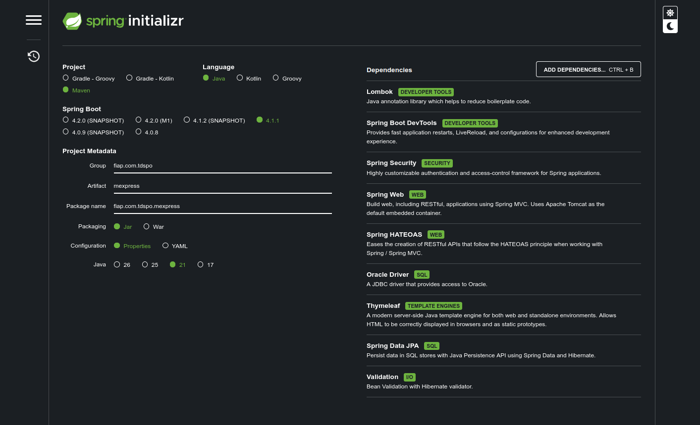

# 🛒 Mercado Express - Spring MVC, Security e Deploy (CP4 Parte II)

## 📋 Descrição do Projeto

O **Mercado Express** é uma aplicação desenvolvida em **Java com Spring Boot** para o gerenciamento de produtos de um mercado.

O projeto é a continuação da **CP4 Parte I**, incorporando uma interface web desenvolvida com **Spring MVC e Thymeleaf**, além de **Spring Security**, containerização com **Docker** e deploy em ambiente de nuvem através do **Render**.

A aplicação disponibiliza:

* CRUD completo de produtos;
* API RESTful;
* Interface web com Thymeleaf;
* Persistência de dados utilizando Oracle;
* Validação de dados com Jakarta Validation;
* HATEOAS nas respostas da API;
* Spring Security para controle de acesso;
* Containerização utilizando Docker;
* Deploy da aplicação no Render.

---

## 👥 Integrantes do Grupo

* **Diego Andrade dos Santos** - RM: 566385
* **Grazielle de Alencar Silva** - RM: 561529
* **Julia Côrrea Souza** - RM: 564870
* **Rafael Kubagawa Ramos** - RM: 565572
* **Vinicius Soteras Braga** - RM: 566230

> **IDE utilizada para o desenvolvimento:** IntelliJ IDEA

---

## 🔗 Repositórios no GitHub

### CP4 — Parte I

https://github.com/BragaSoterasVinicius/cp4pt1

### CP4 — Parte II — Spring MVC

https://github.com/diandrade/fiap-java-cp4pt2

---

## 🎥 Vídeo de Demonstração

O vídeo de demonstração da **CP4 Parte II** está disponível no Google Drive:

https://drive.google.com/file/d/1K0iyqK-HiNOCxIoTVldMzscYIDyMLiWs/view?usp=sharing

---

## ⚙️ Tecnologias e Dependências

O projeto foi desenvolvido utilizando:

* **Java 21**
* **Maven**
* **Spring Boot**
* **Spring Web**
* **Spring MVC**
* **Spring Data JPA**
* **Spring Security**
* **Thymeleaf**
* **Thymeleaf Extras Spring Security**
* **Spring HATEOAS**
* **Jakarta Validation**
* **Lombok**
* **Oracle Database**
* **Docker**
* **Render**

### 📦 Principais dependências

```xml
<dependency>
    <groupId>org.springframework.boot</groupId>
    <artifactId>spring-boot-starter-web</artifactId>
</dependency>

<dependency>
    <groupId>org.springframework.boot</groupId>
    <artifactId>spring-boot-starter-data-jpa</artifactId>
</dependency>

<dependency>
    <groupId>org.springframework.boot</groupId>
    <artifactId>spring-boot-starter-security</artifactId>
</dependency>

<dependency>
    <groupId>org.springframework.boot</groupId>
    <artifactId>spring-boot-starter-thymeleaf</artifactId>
</dependency>

<dependency>
    <groupId>org.springframework.boot</groupId>
    <artifactId>spring-boot-starter-hateoas</artifactId>
</dependency>

<dependency>
    <groupId>org.springframework.boot</groupId>
    <artifactId>spring-boot-starter-validation</artifactId>
</dependency>

<dependency>
    <groupId>org.projectlombok</groupId>
    <artifactId>lombok</artifactId>
    <optional>true</optional>
</dependency>
```

---

## 🗄️ Banco de Dados

O sistema utiliza o **Oracle Database**, reaproveitando a estrutura desenvolvida na CP4 Parte I.

### Tabela principal

`TDS_TB_mercado`

| Coluna    | Tipo                  | Descrição                  |
| :-------- | :-------------------- | :------------------------- |
| `ID`      | `Long`                | Chave primária             |
| `NOME`    | `String`              | Nome do produto            |
| `TIPO`    | `String`              | Categoria do produto       |
| `SETOR`   | `String`              | Setor/corredor do mercado  |
| `TAMANHO` | `String`              | Tamanho ou peso do produto |
| `PRECO`   | `Double / BigDecimal` | Valor unitário do produto  |

As informações de conexão com o banco são configuradas por meio do `application.properties` e, no ambiente de produção, devem ser fornecidas através de variáveis de ambiente.

---

## 🏗️ Arquitetura da Aplicação

A aplicação utiliza uma separação de responsabilidades entre as principais camadas:

```text
Controller
    ↓
Service
    ↓
Repository
    ↓
Database
```

### API REST

A API REST está disponível através do endpoint base:

```text
/mercado
```

Exemplos:

```text
GET     /mercado

GET     /mercado/{id}

POST    /mercado

PUT     /mercado/{id}

PATCH   /mercado/{id}/nome

PATCH   /mercado/{id}/tipo

PATCH   /mercado/{id}/setor

PATCH   /mercado/{id}/tamanho

PATCH   /mercado/{id}/preco

DELETE  /mercado/{id}
```

### Interface Web

A interface desenvolvida com Spring MVC e Thymeleaf está disponível em:

```text
/mercado/web
```

A interface permite:

* Visualizar os produtos cadastrados;
* Cadastrar novos produtos;
* Atualizar produtos;
* Excluir produtos.

---

## 🔐 Spring Security

O projeto utiliza **Spring Security** para controle de acesso às funcionalidades da aplicação.

As rotas são configuradas de acordo com a necessidade de acesso público ou autenticado.

A configuração de segurança está localizada em:

```text
src/main/java/fiap/com/tdspo/mexpress/config/SecurityConfig.java
```

O objetivo da implementação é demonstrar a utilização do mecanismo de autenticação e autorização fornecido pelo Spring Security.

---

## 🌐 Interface Web com Thymeleaf

A interface gráfica foi desenvolvida utilizando **Thymeleaf**, permitindo que o Spring MVC envie os dados dos produtos diretamente para o template HTML.

O principal template da aplicação está localizado em:

```text
src/main/resources/templates/index.html
```

A página apresenta uma interface simples para gerenciamento dos produtos.

### 📸 Interface da aplicação


---

## 🧪 API REST e HATEOAS

A API REST mantém os recursos desenvolvidos na Parte I do projeto.

As respostas utilizam **HATEOAS**, fornecendo links relacionados às operações disponíveis para cada recurso.

### Exemplo de resposta

```json
{
  "id": 1,
  "nome": "Maçã Gala",
  "tipo": "Fruta",
  "setor": "Hortifruti",
  "tamanho": "1kg",
  "preco": 8.50,
  "_links": {
    "self": {
      "href": "http://localhost:8080/mercado/1"
    },
    "atualizar": {
      "href": "http://localhost:8080/mercado/1"
    },
    "deletar": {
      "href": "http://localhost:8080/mercado/1"
    },
    "produtos": {
      "href": "http://localhost:8080/mercado"
    }
  }
}
```

---

## 🚀 Como Executar Localmente

### Pré-requisitos

* Java 21;
* Maven;
* Docker, caso deseje executar através do container;
* Acesso ao banco Oracle.

### Executando pela IDE

Clone o repositório:

```bash
git clone https://github.com/diandrade/fiap-java-cp4pt2.git
```

Entre no diretório do projeto:

```bash
cd fiap-java-cp4pt2/mexpress
```

Execute a aplicação pela IDE ou utilizando o Maven:

```bash
./mvnw spring-boot:run
```

Por padrão, a aplicação utiliza a porta configurada no `application.properties`.

A interface web pode ser acessada em:

```text
http://localhost:8080/mercado/web
```

A API REST pode ser acessada em:

```text
http://localhost:8080/mercado
```

---

## 🐳 Docker

O projeto possui um `Dockerfile` para criação da imagem da aplicação.

A estrutura do repositório é:

```text
fiap-java-cp4pt2/

├── Dockerfile

├── README.md

└── mexpress/

    ├── pom.xml

    ├── mvnw

    ├── .mvn/

    └── src/
```

Como o `Dockerfile` está localizado na raiz do repositório e o projeto Spring Boot está dentro da pasta `mexpress`, o build deve utilizar `mexpress` como contexto:

```bash
docker build -f Dockerfile -t mercado-express mexpress
```

Para executar o container:

```bash
docker run -p 8080:8080 mercado-express
```

Após iniciar o container, a aplicação estará disponível em:

```text
http://localhost:8080/mercado/web
```

---

## ☁️ Deploy

A aplicação foi containerizada utilizando **Docker** e disponibilizada em ambiente de produção através da plataforma **Render**.

### 🔗 Link do Deploy

👉 https://fiap-java-cp4pt2-1.onrender.com

A interface web pode ser acessada através de:

```text
https://fiap-java-cp4pt2-1.onrender.com/mercado/web
```

A API REST está disponível em:

```text
https://fiap-java-cp4pt2-1.onrender.com/mercado
```

### 🚢 Processo de Deploy

O processo utilizado é:

```text
GitHub
   ↓
Render
   ↓
Docker Build
   ↓
Java 21
   ↓
Spring Boot
   ↓
Aplicação Web + API REST
```

O Render realiza o build da aplicação a partir do `Dockerfile` e executa o container em ambiente de produção.

A porta utilizada pela aplicação é definida através da variável de ambiente `PORT` fornecida pelo ambiente de deploy.

---

## 📸 Evidências do Projeto

### Spring Initializr



### Interface Web


### API REST


### Deploy


---

## 📚 Repositórios e Links da Entrega

### CP4 — Parte I

**GitHub:**
https://github.com/BragaSoterasVinicius/cp4pt1

### CP4 — Parte II — Spring MVC

**GitHub:**
https://github.com/diandrade/fiap-java-cp4pt2

### 🚀 Deploy — CP4 Parte II

**Plataforma utilizada:** Render

**Link:**
https://fiap-java-cp4pt2-1.onrender.com

### 🎥 Vídeo de Demonstração — CP4 Parte II

**Google Drive:**
https://drive.google.com/file/d/1K0iyqK-HiNOCxIoTVldMzscYIDyMLiWs/view?usp=sharing

---

> *"Quem ouve, esquece. Quem vê, lembra. Quem faz, aprende."*

**— Provérbio chinês**
