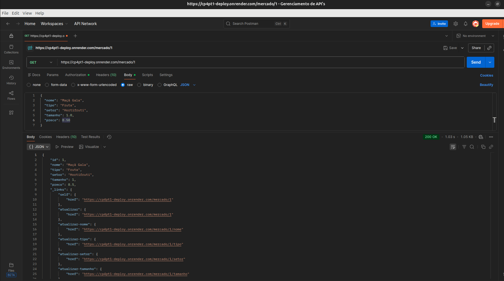
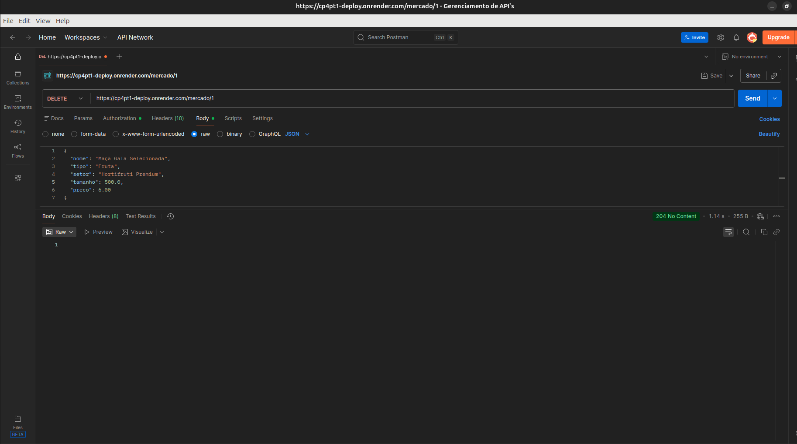

# 🛒 Mercado Express - Spring MVC, Security e Deploy (CP4 Parte II)

## 📋 Descrição do Projeto

Este projeto é uma aplicação desenvolvida em **Java com Spring Boot** para o gerenciamento de produtos de uma empresa do tipo "Mercado Express" (ex: frutas, produtos de limpeza, meias, etc.).

A aplicação é a continuação da **CP4 Parte I**, mantendo o CRUD completo de produtos com persistência de dados em um banco **Oracle** e os conceitos de **HATEOAS** (Nível 3 de Maturidade de Richardson).

Nesta segunda etapa, o projeto incorpora uma **interface web utilizando Spring MVC e Thymeleaf**, além de **Spring Security** para controle de acesso, **validação de dados**, **containerização com Docker** e **deploy em ambiente de nuvem utilizando o Render**.

A aplicação disponibiliza:

* CRUD completo de produtos;
* API RESTful;
* Interface web com Spring MVC e Thymeleaf;
* Persistência de dados utilizando Oracle;
* Validação de dados com Jakarta Validation;
* HATEOAS nas respostas da API;
* Spring Security para controle de acesso;
* Containerização utilizando Docker;
* Deploy em ambiente de nuvem através do Render.

---

## 👥 Integrantes do Grupo (Ordem Alfabética)

* **Diego Andrade dos Santos** - RM: 566385
* **Grazielle de Alencar Silva** - RM: 561529
* **Julia Côrrea Souza** - RM: 564870
* **Rafael Kubagawa Ramos** - RM: 565572
* **Vinicius Soteras Braga** - RM: 566230

> **IDE Utilizada para o desenvolvimento:** IntelliJ IDEA

---

## 🔗 Repositórios

### CP4 Parte I

* **GitHub:** https://github.com/BragaSoterasVinicius/cp4pt1

### CP4 Parte II

* **GitHub:** https://github.com/diandrade/fiap-java-cp4pt2

---

## ⚙️ Tecnologias e Dependências

O projeto foi desenvolvido utilizando as seguintes tecnologias:

* **Java 21** (Linguagem principal)
* **Maven** (Gerenciador de dependências)
* **Spring Boot**
* **Spring Boot Starter Web** (Criação dos endpoints REST)
* **Spring Boot Starter Data JPA** (Persistência e mapeamento ORM)
* **Spring Boot Starter Security** (Autenticação e autorização)
* **Spring Boot Starter Thymeleaf** (Interface web)
* **Spring Boot Starter HATEOAS** (Implementação de links de hipermídia)
* **Spring Boot Starter Validation** (Validação dos dados)
* **Thymeleaf Extras Spring Security**
* **Oracle Driver** (Conexão com o banco Oracle)
* **Lombok** (Redução de boilerplate)
* **Docker** (Containerização)
* **Render** (Deploy da aplicação)

### 📦 Principais Dependências

```xml
<dependency>
    <groupId>org.springframework.boot</groupId>
    <artifactId>spring-boot-starter-web</artifactId>
</dependency>

<dependency>
    <groupId>org.springframework.boot</groupId>
    <artifactId>spring-boot-starter-data-jpa</artifactId>
</dependency>

<dependency>
    <groupId>org.springframework.boot</groupId>
    <artifactId>spring-boot-starter-security</artifactId>
</dependency>

<dependency>
    <groupId>org.springframework.boot</groupId>
    <artifactId>spring-boot-starter-thymeleaf</artifactId>
</dependency>

<dependency>
    <groupId>org.springframework.boot</groupId>
    <artifactId>spring-boot-starter-hateoas</artifactId>
</dependency>

<dependency>
    <groupId>org.springframework.boot</groupId>
    <artifactId>spring-boot-starter-validation</artifactId>
</dependency>

<dependency>
    <groupId>org.projectlombok</groupId>
    <artifactId>lombok</artifactId>
    <optional>true</optional>
</dependency>
```

### 📸 Configuração do Spring Initializr


---

## 🗄️ Banco de Dados

O sistema utiliza o banco de dados **Oracle SQL Developer** (servidor FIAP), reaproveitando a estrutura desenvolvida na CP4 Parte I.

As configurações de conexão estão definidas no arquivo `application.properties`.

**Tabela Mapeada:** `TDS_TB_mercado`

| Coluna    | Tipo (Exemplo)        | Descrição                                  |
| :-------- | :-------------------- | :----------------------------------------- |
| `Id`      | `Long`                | Chave primária autoincrementada            |
| `Nome`    | `String`              | Nome do produto (ex: Sabão em pó)          |
| `Tipo`    | `String`              | Categoria do produto (ex: Limpeza)         |
| `Setor`   | `String`              | Corredor/Setor no mercado (ex: Corredor 3) |
| `Tamanho` | `String`              | Tamanho ou peso (ex: 1kg, M, Grande)       |
| `Preco`   | `Double / BigDecimal` | Valor unitário do produto                  |

---

## 🏗️ Arquitetura da Aplicação

A aplicação mantém a separação de responsabilidades utilizada na Parte I:

```text
Controller
    ↓
Service
    ↓
Repository
    ↓
Database
```

Na Parte II, a camada de Controller passa a contemplar tanto os endpoints da **API REST** quanto a interface web desenvolvida com **Spring MVC**.

---

## 🧪 Endpoints e Testes da API REST

A API REST mantém os endpoints desenvolvidos na CP4 Parte I.

Todas as respostas GET continuam utilizando **HATEOAS**, fornecendo links relacionados aos recursos.

### 1. CREATE - Cadastrar Produto (POST)

* **Endpoint:** `POST http://localhost:8080/mercado`
* **Descrição:** Insere um novo produto no banco de dados.
* **Estrutura JSON (Payload enviado):**

```json
{
  "nome": "Maçã Gala",
  "tipo": "Fruta",
  "setor": "Hortifruti",
  "tamanho": "1kg",
  "preco": 8.50
}
```

📸 **Evidência POST no Postman:**


---

### 2. READ - Listar Produtos (GET)

* **Endpoint:** `GET http://localhost:8080/mercado`
* **Descrição:** Retorna todos os produtos cadastrados com links HATEOAS apontando para os recursos disponíveis.

📸 **Evidência GET lista no Postman:**


---

### 3. READ - Buscar Produto por ID (GET)

* **Endpoint:** `GET http://localhost:8080/mercado/{id}`
* **Descrição:** Busca um produto específico pelo seu ID.
* **Estrutura JSON de Retorno (Exemplo HATEOAS):**

```json
{
  "id": 1,
  "nome": "Maçã Gala",
  "tipo": "Fruta",
  "setor": "Hortifruti",
  "tamanho": "1kg",
  "preco": 8.50,
  "_links": {
    "self": {
      "href": "http://localhost:8080/mercado/1"
    },
    "lista_produtos": {
      "href": "http://localhost:8080/mercado"
    }
  }
}
```

📸 **Evidência GET por ID no Postman:**



---

### 4. UPDATE - Atualizar Produto (PUT / PATCH)

* **Endpoint:** `PUT http://localhost:8080/mercado/{id}`
* **Descrição:** Atualiza os dados de um produto existente.
* **Estrutura JSON (Payload enviado para alteração):**

```json
{
  "nome": "Maçã Gala Selecionada",
  "tipo": "Fruta",
  "setor": "Hortifruti Premium",
  "tamanho": "500g",
  "preco": 6.00
}
```

📸 **Evidência PUT no Postman:**


---

### 5. DELETE - Excluir Produto (DELETE)

* **Endpoint:** `DELETE http://localhost:8080/mercado/{id}`
* **Descrição:** Realiza a exclusão do produto no banco de dados com base no ID informado na URL. Retorna status `204 No Content` em caso de sucesso.

📸 **Evidência DELETE no Postman:**



---

## 🌐 Interface Web com Spring MVC e Thymeleaf

A CP4 Parte II adiciona uma interface web utilizando **Spring MVC** e **Thymeleaf**.

A aplicação permite realizar o gerenciamento dos produtos diretamente através do navegador, sem a necessidade de utilizar ferramentas como Postman ou Insomnia.

### Endpoint da Interface Web

```text
http://localhost:8080/mercado/web
```

A interface permite:

* Visualizar os produtos cadastrados;
* Cadastrar novos produtos;
* Atualizar produtos;
* Excluir produtos.

O template principal da aplicação está localizado em:

```text
src/main/resources/templates/index.html
```

### 📸 Interface do Mercado Express


---

## 🔐 Spring Security

A aplicação utiliza **Spring Security** para controle de acesso aos recursos.

A configuração está localizada em:

```text
src/main/java/fiap/com/tdspo/mexpress/config/SecurityConfig.java
```

O Spring Security foi incorporado ao projeto para demonstrar os mecanismos de autenticação e autorização disponibilizados pelo Spring.

A configuração permite definir quais recursos da aplicação podem ser acessados publicamente e quais necessitam de autenticação.

---

## 🧪 Validação com Jakarta Validation

A aplicação utiliza **Jakarta Validation** para validação dos dados recebidos através dos DTOs.

A validação permite impedir o processamento de informações inválidas antes que elas sejam persistidas no banco de dados.

A dependência utilizada é:

```xml
<dependency>
    <groupId>org.springframework.boot</groupId>
    <artifactId>spring-boot-starter-validation</artifactId>
</dependency>
```

---

## 🔗 HATEOAS

A API REST utiliza **Spring HATEOAS**, mantendo o nível de maturidade alcançado na CP4 Parte I.

As respostas da API apresentam links de hipermídia relacionados aos recursos, permitindo que o consumidor da API navegue entre as operações disponíveis.

### Exemplo de resposta

```json
{
  "id": 1,
  "nome": "Maçã Gala",
  "tipo": "Fruta",
  "setor": "Hortifruti",
  "tamanho": "1kg",
  "preco": 8.50,
  "_links": {
    "self": {
      "href": "http://localhost:8080/mercado/1"
    },
    "atualizar": {
      "href": "http://localhost:8080/mercado/1"
    },
    "deletar": {
      "href": "http://localhost:8080/mercado/1"
    },
    "produtos": {
      "href": "http://localhost:8080/mercado"
    }
  }
}
```

---

## 🚀 Como Executar o Projeto

### Pré-requisitos

* Java 21;
* Maven;
* Docker, caso deseje executar através de container;
* Acesso ao banco Oracle.

### Executando pela IDE

Clone o repositório da Parte II:

```bash
git clone https://github.com/diandrade/fiap-java-cp4pt2.git
```

Entre no diretório do projeto:

```bash
cd fiap-java-cp4pt2/mexpress
```

Execute a aplicação pela IDE ou utilizando o Maven:

```bash
./mvnw spring-boot:run
```

A interface web pode ser acessada em:

```text
http://localhost:8080/mercado/web
```

A API REST pode ser acessada em:

```text
http://localhost:8080/mercado
```

---

## 🐳 Docker

O projeto possui um `Dockerfile` para criação da imagem da aplicação.

A estrutura atual do repositório é:

```text
fiap-java-cp4pt2/

├── Dockerfile

├── README.md

└── mexpress/

    ├── pom.xml

    ├── mvnw

    ├── .mvn/

    └── src/
```

Como o `Dockerfile` está localizado na raiz do repositório e o projeto Spring Boot está dentro da pasta `mexpress`, o contexto utilizado para o build é o diretório `mexpress`.

### Criando a imagem Docker

```bash
docker build -f Dockerfile -t mercado-express mexpress
```

### Executando o container

```bash
docker run -p 8080:8080 mercado-express
```

Após iniciar o container, a interface web estará disponível em:

```text
http://localhost:8080/mercado/web
```

E a API REST em:

```text
http://localhost:8080/mercado
```

---

## ☁️ Deploy da Aplicação

A aplicação foi containerizada utilizando **Docker** e disponibilizada em ambiente de produção através da plataforma **Render**.

### 🚀 Plataforma utilizada

**Render**

### 🔗 Link do Deploy

👉 https://fiap-java-cp4pt2-1.onrender.com

### 🌐 Interface Web em produção

```text
https://fiap-java-cp4pt2-1.onrender.com/mercado/web
```

### 🔌 API REST em produção

```text
https://fiap-java-cp4pt2-1.onrender.com/mercado
```

### 🚢 Processo de Deploy

O processo utilizado foi:

```text
GitHub
   ↓
Render
   ↓
Docker Build
   ↓
Java 21
   ↓
Spring Boot
   ↓
Aplicação Web + API REST
```

O Render realiza o build da aplicação utilizando o `Dockerfile` e executa o container em ambiente de produção.

A porta utilizada pela aplicação é definida através da variável de ambiente `PORT` fornecida pelo ambiente de deploy.

---

## 📸 Evidências do Projeto

### 📸 Configuração do Spring Initializr


### 📸 Interface Web


### 📸 CREATE - POST


### 📸 READ - Lista de Produtos


### 📸 READ - Produto por ID


### 📸 UPDATE - PUT


### 📸 DELETE - Produto


### 📸 Deploy no Render


---

## 📚 Links da Entrega

### CP4 — Parte I

**GitHub:**
https://github.com/BragaSoterasVinicius/cp4pt1

### CP4 — Parte II — Spring MVC

**GitHub:**
https://github.com/diandrade/fiap-java-cp4pt2

### 🚀 Deploy — CP4 Parte II

**Plataforma utilizada:** Render

**Link:**
https://fiap-java-cp4pt2-1.onrender.com

### 🎥 Vídeo de Demonstração — CP4 Parte II

**Google Drive:**
https://drive.google.com/file/d/1K0iyqK-HiNOCxIoTVldMzscYIDyMLiWs/view?usp=sharing

---

*"Quem ouve, esquece. Quem vê, lembra. Quem faz, aprende." - Provérbio chinês*
